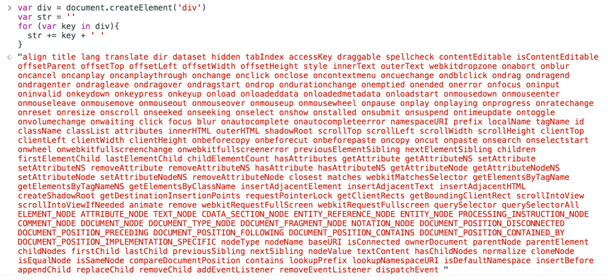

# 数据驱动

Vue.js 一个核心思想是数据驱动。所谓数据驱动，是指视图是由数据驱动生成的，我们对视图的修改，不会直接操作 DOM，而是通过修改数据。它相比我们传统的前端开发，如使用 jQuery 等前端库直接修改 DOM，大大简化了代码量。特别是当交互复杂的时候，只关心数据的修改会让代码的逻辑变的非常清晰，因为 DOM 变成了数据的映射，我们所有的逻辑都是对数据的修改，而不用碰触 DOM，这样的代码非常利于维护。

在 Vue.js 中我们可以采用简洁的模板语法来声明式的将数据渲染为 DOM：

```html
<div id="app">
  {{ message }}
</div>
```

```js
var app = new Vue({
  el: '#app',
  data: {
    message: 'Hello Vue!'
  }
})
```

最终它会在页面上渲染出 `Hello Vue`。接下来，我们会从源码角度来分析 Vue 是如何实现的，分析过程会以主线代码为主，重要的分支逻辑会放在之后单独分析。数据驱动还有一部分是数据更新驱动视图变化，这一块内容我们也会在之后的章节分析，这一章我们的目标是弄清楚模板和数据如何渲染成最终的 DOM。

## new Vue 发生了什么

 从入口代码开始分析，我们先来分析 `new Vue` 背后发生了哪些事情。我们都知道，`new` 关键字在 Javascript 语言中代表实例化是一个对象，而 `Vue` 实际上是一个类，类在 Javascript 中是用 Function 来实现的，来看一下源码，在`src/core/instance/index.js` 中。

```js
function Vue (options) {
  if (process.env.NODE_ENV !== 'production' &&
    !(this instanceof Vue)
  ) {
    warn('Vue is a constructor and should be called with the `new` keyword')
  }
  this._init(options)
}
```

可以看到 `Vue` 只能通过 new 关键字初始化，然后会调用 `this._init` 方法， 该方法在 `src/core/instance/init.js` 中定义。

```js
export function initMixin (Vue: Class<Component>) {
  Vue.prototype._init = function (options?: Object) {
    const vm: Component = this
    // a uid
    vm._uid = uid++

    let startTag, endTag
    /* istanbul ignore if */
    if (process.env.NODE_ENV !== 'production' && config.performance && mark) {
      startTag = `vue-perf-start:${vm._uid}`
      endTag = `vue-perf-end:${vm._uid}`
      mark(startTag)
    }

    // a flag to avoid this being observed
    vm._isVue = true
    // merge options
    if (options && options._isComponent) {
      // optimize internal component instantiation
      // since dynamic options merging is pretty slow, and none of the
      // internal component options needs special treatment.
      initInternalComponent(vm, options)
    } else {
      vm.$options = mergeOptions(
        resolveConstructorOptions(vm.constructor),
        options || {},
        vm
      )
    }
    /* istanbul ignore else */
    if (process.env.NODE_ENV !== 'production') {
      initProxy(vm)
    } else {
      vm._renderProxy = vm
    }
    // expose real self
    vm._self = vm
    initLifecycle(vm)
    initEvents(vm)
    initRender(vm)
    callHook(vm, 'beforeCreate')
    initInjections(vm) // resolve injections before data/props
    initState(vm)
    initProvide(vm) // resolve provide after data/props
    callHook(vm, 'created')

    /* istanbul ignore if */
    if (process.env.NODE_ENV !== 'production' && config.performance && mark) {
      vm._name = formatComponentName(vm, false)
      mark(endTag)
      measure(`vue ${vm._name} init`, startTag, endTag)
    }

    if (vm.$options.el) {
      vm.$mount(vm.$options.el)
    }
  }
}
```

Vue 初始化主要就干了几件事情，合并配置，初始化生命周期，初始化事件中心，初始化渲染，初始化 data、props、computed、watcher 等等。

Vue 的初始化逻辑写的非常清楚，把不同的功能逻辑拆成一些单独的函数执行，让主线逻辑一目了然，这样的编程思想是非常值得借鉴和学习的。

在初始化的最后，检测到如果有 `el` 属性，则调用 `vm.$mount` 方法挂载 `vm`，挂载的目标就是把模板渲染成最终的 DOM，那么接下来我们来分析 Vue 的挂载过程。

## Vue 实例挂载的实现

Vue 中我们是通过 `$mount` 实例方法去挂载 `vm` 的，`$mount` 方法在多个文件中都有定义，如 `src/platform/web/entry-runtime-with-compiler.js`、`src/platform/web/runtime/index.js`、`src/platform/weex/runtime/index.js`。因为 `$mount` 这个方法的实现是和平台、构建方式都相关的。接下来我们重点分析带 `compiler` 版本的 `$mount` 实现，因为抛开 webpack 的 vue-loader，我们在纯前端浏览器环境分析 Vue 的工作原理，有助于我们对原理理解的深入。

`compiler` 版本的 `$mount` 实现非常有意思，先来看一下 `src/platform/web/entry-runtime-with-compiler.js` 文件中定义：

```js
const mount = Vue.prototype.$mount
Vue.prototype.$mount = function (
  el?: string | Element,
  hydrating?: boolean
): Component {
  el = el && query(el)

  /* istanbul ignore if */
  if (el === document.body || el === document.documentElement) {
    process.env.NODE_ENV !== 'production' && warn(
      `Do not mount Vue to <html> or <body> - mount to normal elements instead.`
    )
    return this
  }

  const options = this.$options
  // resolve template/el and convert to render function
  if (!options.render) {
    let template = options.template
    if (template) {
      if (typeof template === 'string') {
        if (template.charAt(0) === '#') {
          template = idToTemplate(template)
          /* istanbul ignore if */
          if (process.env.NODE_ENV !== 'production' && !template) {
            warn(
              `Template element not found or is empty: ${options.template}`,
              this
            )
          }
        }
      } else if (template.nodeType) {
        template = template.innerHTML
      } else {
        if (process.env.NODE_ENV !== 'production') {
          warn('invalid template option:' + template, this)
        }
        return this
      }
    } else if (el) {
      template = getOuterHTML(el)
    }
    if (template) {
      /* istanbul ignore if */
      if (process.env.NODE_ENV !== 'production' && config.performance && mark) {
        mark('compile')
      }

      const { render, staticRenderFns } = compileToFunctions(template, {
        outputSourceRange: process.env.NODE_ENV !== 'production',
        shouldDecodeNewlines,
        shouldDecodeNewlinesForHref,
        delimiters: options.delimiters,
        comments: options.comments
      }, this)
      options.render = render
      options.staticRenderFns = staticRenderFns

      /* istanbul ignore if */
      if (process.env.NODE_ENV !== 'production' && config.performance && mark) {
        mark('compile end')
        measure(`vue ${this._name} compile`, 'compile', 'compile end')
      }
    }
  }
  return mount.call(this, el, hydrating)
}
```

这段代码首先缓存了原型上的 `$mount` 方法，再重新定义该方法，我们先来分析这段代码。首先，它对 `el` 做了限制，Vue 不能挂载在 `body`、`html` 这样的根节点上。接下来的是很关键的逻辑 —— 如果没有定义 `render` 方法，则会把 `el` 或者 `template` 字符串转换成 `render` 方法。这里我们要牢记，在 Vue 2.0 版本中，所有 Vue 的组件的渲染最终都需要 `render` 方法，无论我们是用单文件 .vue 方式开发组件，还是写了 `el` 或者 `template` 属性，最终都会转换成 `render` 方法，那么这个过程是 Vue 的一个“在线编译”的过程，它是调用 `compileToFunctions` 方法实现的，编译过程我们之后会介绍。最后，调用原先原型上的 `$mount` 方法挂载。

原先原型上的 `$mount` 方法在 `src/platform/web/runtime/index.js` 中定义，之所以这么设计完全是为了复用，因为它是可以被 `runtime only` 版本的 Vue 直接使用的。

```js
// public mount method
Vue.prototype.$mount = function (
  el?: string | Element,
  hydrating?: boolean
): Component {
  el = el && inBrowser ? query(el) : undefined
  return mountComponent(this, el, hydrating)
```

`$mount` 方法支持传入 2 个参数，第一个是 `el`，它表示挂载的元素，可以是字符串，也可以是 DOM 对象，如果是字符串在浏览器环境下会调用 `query` 方法转换成 DOM 对象的。第二个参数是和服务端渲染相关，在浏览器环境下我们不需要传第二个参数。

`$mount` 方法实际上会去调用 `mountComponent` 方法，这个方法定义在 `src/core/instance/lifecycle.js` 文件中：

```js
export function mountComponent (
  vm: Component,
  el: ?Element,
  hydrating?: boolean
): Component {
  vm.$el = el
  if (!vm.$options.render) {
    vm.$options.render = createEmptyVNode
    if (process.env.NODE_ENV !== 'production') {
      /* istanbul ignore if */
      if ((vm.$options.template && vm.$options.template.charAt(0) !== '#') ||
        vm.$options.el || el) {
        warn(
          'You are using the runtime-only build of Vue where the template ' +
          'compiler is not available. Either pre-compile the templates into ' +
          'render functions, or use the compiler-included build.',
          vm
        )
      } else {
        warn(
          'Failed to mount component: template or render function not defined.',
          vm
        )
      }
    }
  }
  callHook(vm, 'beforeMount')

  let updateComponent
  /* istanbul ignore if */
  if (process.env.NODE_ENV !== 'production' && config.performance && mark) {
    updateComponent = () => {
      const name = vm._name
      const id = vm._uid
      const startTag = `vue-perf-start:${id}`
      const endTag = `vue-perf-end:${id}`

      mark(startTag)
      const vnode = vm._render()
      mark(endTag)
      measure(`vue ${name} render`, startTag, endTag)

      mark(startTag)
      vm._update(vnode, hydrating)
      mark(endTag)
      measure(`vue ${name} patch`, startTag, endTag)
    }
  } else {
    updateComponent = () => {
      vm._update(vm._render(), hydrating)
    }
  }

  // we set this to vm._watcher inside the watcher's constructor
  // since the watcher's initial patch may call $forceUpdate (e.g. inside child
  // component's mounted hook), which relies on vm._watcher being already defined
  new Watcher(vm, updateComponent, noop, {
    before () {
      if (vm._isMounted && !vm._isDestroyed) {
        callHook(vm, 'beforeUpdate')
      }
    }
  }, true /* isRenderWatcher */)
  hydrating = false

  // manually mounted instance, call mounted on self
  // mounted is called for render-created child components in its inserted hook
  if (vm.$vnode == null) {
    vm._isMounted = true
    callHook(vm, 'mounted')
  }
  return vm
}
```

从上面的代码可以看到，`mountComponent` 核心就是先实例化一个渲染`Watcher`，在它的回调函数中会调用 `updateComponent` 方法，在此方法中调用 `vm._render` 方法先生成虚拟 Node，最终调用 `vm._update` 更新 DOM。

`Watcher` 在这里起到两个作用，一个是初始化的时候会执行回调函数，另一个是当 vm 实例中的监测的数据发生变化的时候执行回调函数，

函数最后判断为根节点的时候设置 `vm._isMounted` 为 `true`， 表示这个实例已经挂载了，同时执行 `mounted` 钩子函数。 这里注意 `vm.$vnode` 表示 Vue 实例的父虚拟 Node，所以它为 `Null` 则表示当前是根 Vue 的实例。

`mountComponent` 方法的逻辑也是非常清晰的，它会完成整个渲染工作，接下来我们要重点分析其中的细节，也就是最核心的 2 个方法：`vm._render` 和 `vm._update`。

## render

Vue 的 `_render` 方法是实例的一个私有方法，它用来把实例渲染成一个虚拟 Node。它的定义在 `src/core/instance/render.js` 文件中：

```js
  Vue.prototype._render = function (): VNode {
    const vm: Component = this
    const { render, _parentVnode } = vm.$options

    if (_parentVnode) {
      vm.$scopedSlots = normalizeScopedSlots(
        _parentVnode.data.scopedSlots,
        vm.$slots,
        vm.$scopedSlots
      )
    }

    // set parent vnode. this allows render functions to have access
    // to the data on the placeholder node.
    // 设置 parent vnode。 这允许呈现函数访问占位符节点上的数据。
    vm.$vnode = _parentVnode
    // render self
    let vnode
    try {
      // There's no need to maintain a stack because all render fns are called 
      // separately from one another. Nested component's render fns are called
      // when parent component is patched.
      // 没有必要维护一个堆栈，因为所有的渲染fns都是彼此分开调用的。 当父组件被修补时，会调用嵌套组件的渲染fns。
      currentRenderingInstance = vm
      vnode = render.call(vm._renderProxy, vm.$createElement)
    } catch (e) {
      handleError(e, vm, `render`)
      // return error render result,
      // or previous vnode to prevent render error causing blank component
      // 返回错误呈现结果，或之前的vnode，以防止呈现错误导致空白组件
      /* istanbul ignore else */
      if (process.env.NODE_ENV !== 'production' && vm.$options.renderError) {
        try {
          vnode = vm.$options.renderError.call(vm._renderProxy, vm.$createElement, e)
        } catch (e) {
          handleError(e, vm, `renderError`)
          vnode = vm._vnode
        }
      } else {
        vnode = vm._vnode
      }
    } finally {
      currentRenderingInstance = null
    }
    // if the returned array contains only a single node, allow it
    // 如果返回的数组只包含一个节点，设置vnode数组为vnode单个对象
    if (Array.isArray(vnode) && vnode.length === 1) {
      vnode = vnode[0]
    }
    // return empty vnode in case the render function errored out
    // 返回空的vnode，以防呈现函数出错
    if (!(vnode instanceof VNode)) {
      if (process.env.NODE_ENV !== 'production' && Array.isArray(vnode)) {
        warn(
          'Multiple root nodes returned from render function. Render function ' +
          'should return a single root node.',
          vm
        )
      }
      vnode = createEmptyVNode()
    }
    // set parent
    // 设置父级
    vnode.parent = _parentVnode
    return vnode
  }
```

这段代码最关键的是 `render` 方法的调用，我们在平时的开发工作中手写 `render` 方法的场景比较少，而写的比较多的是 `template` 模板，在之前的 `mounted` 方法的实现中，会把 `template` 编译成 `render` 方法，但这个编译过程是非常复杂的

在 Vue 的官方文档中介绍了 `render` 函数的第一个参数是 `createElement`，那么结合之前的例子

```html
<div id="app">
  {{ message }}
</div>
```

相当于我们编写如下 `render` 函数：

```js
render: function (createElement) {
  return createElement('div', {
     attrs: {
        id: 'app1'
      },
  }, this.message)
}
```

再回到 `_render` 函数中的 `render` 方法的调用：

```js
vnode = render.call(vm._renderProxy, vm.$createElement)
```

可以看到，`render` 函数中的 `createElement` 方法就是 `vm.$createElement` 方法：

```js
export function initRender (vm: Component) {
  vm._vnode = null // the root of the child tree
  vm._staticTrees = null // v-once cached trees
  const options = vm.$options
  const parentVnode = vm.$vnode = options._parentVnode // the placeholder node in parent tree
  const renderContext = parentVnode && parentVnode.context
  vm.$slots = resolveSlots(options._renderChildren, renderContext)
  vm.$scopedSlots = emptyObject
  // bind the createElement fn to this instance
  // so that we get proper render context inside it.
  // 将createElement fn绑定到这个实例中，这样我们就可以在这个实例中获得正确的渲染上下文  
  // args order: tag, data, children, normalizationType, alwaysNormalize
  // internal version is used by render functions compiled from templates
  vm._c = (a, b, c, d) => createElement(vm, a, b, c, d, false)
  // normalization is always applied for the public version, used in
  // user-written render functions.
  // 在用户编写的 render 函数中，总是对公共版本应用规范化。
  vm.$createElement = (a, b, c, d) => createElement(vm, a, b, c, d, true)

  // $attrs & $listeners are exposed for easier HOC creation.
  // they need to be reactive so that HOCs using them are always updated
  const parentData = parentVnode && parentVnode.data

  /* istanbul ignore else */
  if (process.env.NODE_ENV !== 'production') {
    defineReactive(vm, '$attrs', parentData && parentData.attrs || emptyObject, () => {
      !isUpdatingChildComponent && warn(`$attrs is readonly.`, vm)
    }, true)
    defineReactive(vm, '$listeners', options._parentListeners || emptyObject, () => {
      !isUpdatingChildComponent && warn(`$listeners is readonly.`, vm)
    }, true)
  } else {
    defineReactive(vm, '$attrs', parentData && parentData.attrs || emptyObject, null, true)
    defineReactive(vm, '$listeners', options._parentListeners || emptyObject, null, true)
  }
}
```

实际上，`vm.$createElement` 方法定义是在执行 `initRender` 方法的时候，可以看到除了 `vm.$createElement` 方法，还有一个 `vm._c` 方法，它是被模板编译成的 `render` 函数使用，而 `vm.$createElement` 是用户手写 `render` 方法使用的， 这俩个方法支持的参数相同，并且内部都调用了 `createElement` 方法。

**显示结果**


`vm._render` 最终是通过执行 `createElement` 方法并返回的是 `vnode`，它是一个虚拟 Node。

Vue 2.0 相比 Vue 1.0 最大的升级就是利用了 Virtual DOM。因此在分析 `createElement` 的实现前，先了解一下 Virtual DOM 的概念。

## Virtual DOM（虚拟dom）

Virtual DOM 这个概念相信大部分人都不会陌生，它产生的前提是浏览器中的 DOM 是很“昂贵"的，为了更直观的感受，我们可以简单的把一个简单的 div 元素的属性都打印出来，如图所示：




可以看到，真正的 DOM 元素是非常庞大的，因为浏览器的标准就把 DOM 设计的非常复杂。当我们频繁的去做 DOM 更新，会产生一定的性能问题。

而 Virtual DOM 就是用一个原生的 JS 对象去描述一个 DOM 节点，所以它比创建一个 DOM 的代价要小很多。在 Vue.js 中，Virtual DOM 是用 `VNode` 这么一个 Class 去描述，它是定义在 `src/core/vdom/vnode.js` 中的。

```js
export default class VNode {
  tag: string | void;
  data: VNodeData | void;
  children: ?Array<VNode>;
  text: string | void;
  elm: Node | void;
  ns: string | void;
  context: Component | void; // rendered in this component's scope
  key: string | number | void;
  componentOptions: VNodeComponentOptions | void;
  componentInstance: Component | void; // component instance
  parent: VNode | void; // component placeholder node

  // strictly internal
  raw: boolean; // contains raw HTML? (server only)
  isStatic: boolean; // hoisted static node
  isRootInsert: boolean; // necessary for enter transition check
  isComment: boolean; // empty comment placeholder?
  isCloned: boolean; // is a cloned node?
  isOnce: boolean; // is a v-once node?
  asyncFactory: Function | void; // async component factory function
  asyncMeta: Object | void;
  isAsyncPlaceholder: boolean;
  ssrContext: Object | void;
  fnContext: Component | void; // real context vm for functional nodes
  fnOptions: ?ComponentOptions; // for SSR caching
  devtoolsMeta: ?Object; // used to store functional render context for devtools
  fnScopeId: ?string; // functional scope id support

  constructor (
    tag?: string,
    data?: VNodeData,
    children?: ?Array<VNode>,
    text?: string,
    elm?: Node,
    context?: Component,
    componentOptions?: VNodeComponentOptions,
    asyncFactory?: Function
  ) {
    this.tag = tag
    this.data = data
    this.children = children
    this.text = text
    this.elm = elm
    this.ns = undefined
    this.context = context
    this.fnContext = undefined
    this.fnOptions = undefined
    this.fnScopeId = undefined
    this.key = data && data.key
    this.componentOptions = componentOptions
    this.componentInstance = undefined
    this.parent = undefined
    this.raw = false
    this.isStatic = false
    this.isRootInsert = true
    this.isComment = false
    this.isCloned = false
    this.isOnce = false
    this.asyncFactory = asyncFactory
    this.asyncMeta = undefined
    this.isAsyncPlaceholder = false
  }

  // DEPRECATED: alias for componentInstance for backwards compat.
  /* istanbul ignore next */
  get child (): Component | void {
    return this.componentInstance
  }
}
```

可以看到 Vue.js 中的 Virtual DOM 的定义还是略微复杂一些的，因为它这里包含了很多 Vue.js 的特性。这里千万不要被这些茫茫多的属性吓到，实际上 Vue.js 中 Virtual DOM 是借鉴了一个开源库 [snabbdom](https://github.com/snabbdom/snabbdom) 的实现，然后加入了一些 Vue.js 特色的东西。我建议大家如果想深入了解 Vue.js 的 Virtual DOM 前不妨先阅读这个库的源码，因为它更加简单和纯粹。

其实 VNode 是对真实 DOM 的一种抽象描述，它的核心定义无非就几个关键属性，标签名、数据、子节点、键值等，其它属性都是用来扩展 VNode 的灵活性以及实现一些特殊 feature 的。由于 VNode 只是用来映射到真实 DOM 的渲染，不需要包含操作 DOM 的方法，因此它是非常轻量和简单的。

Virtual DOM 除了它的数据结构的定义，映射到真实的 DOM 实际上要经历 VNode 的 create、diff、patch 等过程。那么在 Vue.js 中，VNode 的 create 是通过之前提到的 `createElement` 方法创建的，接下来分析这部分的实现。

## createElement

Vue.js 利用 createElement 方法创建 VNode，它定义在 `src/core/vdom/create-element.js` 中：

```js
// wrapper function for providing a more flexible interface
// 包装器函数，提供更灵活的接口
// without getting yelled at by flow
export function createElement (
  context: Component,
  tag: any,
  data: any,
  children: any,
  normalizationType: any,
  alwaysNormalize: boolean
): VNode | Array<VNode> {
  if (Array.isArray(data) || isPrimitive(data)) {
    normalizationType = children
    children = data
    data = undefined
  }
  if (isTrue(alwaysNormalize)) {
    normalizationType = ALWAYS_NORMALIZE
  }
  return _createElement(context, tag, data, children, normalizationType)
}
```

`createElement` 方法实际上是对 `_createElement` 方法的封装，它允许传入的参数更加灵活，在处理这些参数后，调用真正创建 VNode 的函数 `_createElement`：

```js
export function _createElement (
  context: Component,
  tag?: string | Class<Component> | Function | Object,
  data?: VNodeData,
  children?: any,
  normalizationType?: number
): VNode | Array<VNode> {
  if (isDef(data) && isDef((data: any).__ob__)) {
    process.env.NODE_ENV !== 'production' && warn(
      `Avoid using observed data object as vnode data: ${JSON.stringify(data)}\n`      'Always create fresh vnode data objects in each render!',
      context
    )
    return createEmptyVNode()
  }
  // object syntax in v-bind
  if (isDef(data) && isDef(data.is)) {
    tag = data.is
  }
  if (!tag) {
    // in case of component :is set to falsy value
    return createEmptyVNode()
  }
  // warn against non-primitive key
  if (process.env.NODE_ENV !== 'production' &&
    isDef(data) && isDef(data.key) && !isPrimitive(data.key)
  ) {
    if (!__WEEX__ || !('@binding' in data.key)) {
      warn(
        'Avoid using non-primitive value as key, ' +
        'use string/number value instead.',
        context
      )
    }
  }
  // support single function children as default scoped slot
  // 支持单函数子作为默认作用域槽
  if (Array.isArray(children) &&
    typeof children[0] === 'function'
  ) {
    data = data || {}
    data.scopedSlots = { default: children[0] }
    children.length = 0
  }
  if (normalizationType === ALWAYS_NORMALIZE) {
    children = normalizeChildren(children)
  } else if (normalizationType === SIMPLE_NORMALIZE) {
    children = simpleNormalizeChildren(children)
  }
  let vnode, ns
  if (typeof tag === 'string') {
    let Ctor
    ns = (context.$vnode && context.$vnode.ns) || config.getTagNamespace(tag)
    if (config.isReservedTag(tag)) {
      // platform built-in elements
      if (process.env.NODE_ENV !== 'production' && isDef(data) && isDef(data.nativeOn) && data.tag !== 'component') {
        warn(
          `The .native modifier for v-on is only valid on components but it was used on <${tag}>.`,
          context
        )
      }
      vnode = new VNode(
        config.parsePlatformTagName(tag), data, children,
        undefined, undefined, context
      )
    } else if ((!data || !data.pre) && isDef(Ctor = resolveAsset(context.$options, 'components', tag))) {
      // component
      vnode = createComponent(Ctor, data, context, children, tag)
    } else {
      // unknown or unlisted namespaced elements
      // check at runtime because it may get assigned a namespace when its
      // parent normalizes children
      // 未知或未列出的名称空间元素会在运行时进行检查，因为当它的父元素规范化子元素时，可能会给它分配一个名称空间
      vnode = new VNode(
        tag, data, children,
        undefined, undefined, context
      )
    }
  } else {
    // direct component options / constructor
    vnode = createComponent(tag, data, context, children)
  }
  if (Array.isArray(vnode)) {
    return vnode
  } else if (isDef(vnode)) {
    if (isDef(ns)) applyNS(vnode, ns)
    if (isDef(data)) registerDeepBindings(data)
    return vnode
  } else {
    return createEmptyVNode()
  }
}
```

`_createElement` 方法有 5 个参数，`context` 表示 VNode 的上下文环境，它是 `Component` 类型；`tag` 表示标签，它可以是一个字符串，也可以是一个 `Component`；`data` 表示 VNode 的数据，它是一个 `VNodeData` 类型，可以在 `flow/vnode.js` 中找到它的定义，这里先不展开说；`children` 表示当前 VNode 的子节点，它是任意类型的，它接下来需要被规范为标准的 VNode 数组；`normalizationType` 表示子节点规范的类型，类型不同规范的方法也就不一样，它主要是参考 `render` 函数是编译生成的还是用户手写的。

`createElement` 函数的流程略微有点多，我们接下来主要分析 2 个重点的流程 —— `children` 的规范化以及 VNode 的创建。

### children 的规范化

由于 Virtual DOM 实际上是一个树状结构，每一个 VNode 可能会有若干个子节点，这些子节点应该也是 VNode 的类型。`_createElement` 接收的第 4 个参数 children 是任意类型的，因此我们需要把它们规范成 VNode 类型。

这里根据 `normalizationType` 的不同，调用了 `normalizeChildren(children)` 和 `simpleNormalizeChildren(children)` 方法，它们的定义都在 `src/core/vdom/helpers/normalzie-children.js` 中：

```js
// 1. When the children contains components - because a functional component
// may return an Array instead of a single root. In this case, just a simple
// normalization is needed - if any child is an Array, we flatten the whole
// thing with Array.prototype.concat. It is guaranteed to be only 1-level deep
// because functional components already normalize their own children.
// 当子组件包含组件时—因为功能组件可能返回一个Array而不是单个根。 在这种情况下
// ，只需要一个简单的标准化——如果任何子元素是Array，我们就用Array.prototype.concat将整个东西平铺开来。
// 它保证只有1级深度，因为功能组件已经规范化了它们自己的子组件。
export function simpleNormalizeChildren (children: any) {
  for (let i = 0; i < children.length; i++) {
    if (Array.isArray(children[i])) {
      return Array.prototype.concat.apply([], children)
    }
  }
  return children
}

// 2. When the children contains constructs that always generated nested Arrays,
// e.g. <template>, <slot>, v-for, or when the children is provided by user
// with hand-written render functions / JSX. In such cases a full normalization
// is needed to cater to all possible types of children values.
// 当子元素包含总是生成嵌套数组的构造时，例如<template>， <slot>， v-for，或者当子元素
// 由用户用手写的呈现函数/ JSX提供时。 在这种情况下，需要完全规范化，迎合所有可能类型的 child 的值
export function normalizeChildren (children: any): ?Array<VNode> {
  return isPrimitive(children)
    ? [createTextVNode(children)]
    : Array.isArray(children)
      ? normalizeArrayChildren(children)
      : undefined
}
```

`simpleNormalizeChildren` 方法调用场景是 `render` 函数是编译生成的。理论上编译生成的 `children` 都已经是 VNode 类型的，但这里有一个例外，就是 `functional component` 函数式组件返回的是一个数组而不是一个根节点，所以会通过 `Array.prototype.concat` 方法把整个 `children` 数组打平，让它的深度只有一层。

`normalizeChildren` 方法的调用场景有 2 种，一个场景是 `render` 函数是用户手写的，当 `children` 只有一个节点的时候，Vue.js 从接口层面允许用户把 `children` 写成基础类型用来创建单个简单的文本节点，这种情况会调用 `createTextVNode` 创建一个文本节点的 VNode；另一个场景是当编译 `slot`、`v-for` 的时候会产生嵌套数组的情况，会调用 `normalizeArrayChildren` 方法，接下来看一下它的实现：

```js
//  `normalizeArrayChildren` 主要的逻辑就是遍历 `children`，获得单个节点 `c`，然后对 `c` 的类型判断，
// 如果是一个数组类型，则递归调用 `normalizeArrayChildren`; 如果是基础类型，则通过 `createTextVNode` 方法转换成 VNode 类型；
// 否则就已经是 VNode 类型了，如果 `children` 是一个列表并且列表还存在嵌套的情况，则根据 `nestedIndex` 去更新它的 key。
// 这里需要注意一点，在遍历的过程中，对这 3 种情况都做了如下处理：如果存在两个连续的 `text` 节点，会把它们合并成一个 `text` 节点。
function normalizeArrayChildren (children: any, nestedIndex?: string): Array<VNode> {
  const res = []
  let i, c, lastIndex, last
  for (i = 0; i < children.length; i++) {
    c = children[i]
    if (isUndef(c) || typeof c === 'boolean') continue
    lastIndex = res.length - 1
    last = res[lastIndex]
    //  nested
    if (Array.isArray(c)) {
      if (c.length > 0) {
        c = normalizeArrayChildren(c, `${nestedIndex || ''}_${i}`)
        // merge adjacent text nodes
        if (isTextNode(c[0]) && isTextNode(last)) {
          res[lastIndex] = createTextVNode(last.text + (c[0]: any).text)
          c.shift()
        }
        res.push.apply(res, c)
      }
    } else if (isPrimitive(c)) {
      if (isTextNode(last)) {
        // merge adjacent text nodes
        // this is necessary for SSR hydration because text nodes are
        // essentially merged when rendered to HTML strings
        res[lastIndex] = createTextVNode(last.text + c)
      } else if (c !== '') {
        // convert primitive to vnode
        res.push(createTextVNode(c))
      }
    } else {
      if (isTextNode(c) && isTextNode(last)) {
        // merge adjacent text nodes
        res[lastIndex] = createTextVNode(last.text + c.text)
      } else {
        // default key for nested array children (likely generated by v-for)
        if (isTrue(children._isVList) &&
          isDef(c.tag) &&
          isUndef(c.key) &&
          isDef(nestedIndex)) {
          c.key = `__vlist${nestedIndex}_${i}__`
        }
        res.push(c)
      }
    }
  }
  return res
}
```

经过对 `children` 的规范化，`children` 变成了一个类型为 VNode 的 Array。

### VNode 的创建

回到 `createElement` 函数，规范化 `children` 后，接下来会去创建一个 VNode 的实例：

```js
let vnode, ns
if (typeof tag === 'string') {
  let Ctor
  ns = (context.$vnode && context.$vnode.ns) || config.getTagNamespace(tag)
  if (config.isReservedTag(tag)) {
    // platform built-in elements
    vnode = new VNode(
      config.parsePlatformTagName(tag), data, children,
      undefined, undefined, context
    )
  } else if (isDef(Ctor = resolveAsset(context.$options, 'components', tag))) {
    // component
    vnode = createComponent(Ctor, data, context, children, tag)
  } else {
    // unknown or unlisted namespaced elements
    // check at runtime because it may get assigned a namespace when its
    // parent normalizes children
    vnode = new VNode(
      tag, data, children,
      undefined, undefined, context
    )
  }
} else {
  // direct component options / constructor
  vnode = createComponent(tag, data, context, children)
}
```

这里先对 `tag` 做判断，如果是 `string` 类型，则接着判断如果是内置的一些节点，则直接创建一个普通 VNode，如果是为已注册的组件名，则通过 `createComponent` 创建一个组件类型的 VNode，否则创建一个未知的标签的 VNode。 如果是 `tag` 一个 `Component` 类型，则直接调用 `createComponent` 创建一个组件类型的 VNode 节点。对于 `createComponent` 创建组件类型的 VNode 的过程，我们之后会去介绍，本质上它还是返回了一个 VNode。

那么至此，我们大致了解了 `createElement` 创建 VNode 的过程，每个 VNode 有 `children`，`children` 每个元素也是一个 VNode，这样就形成了一个 VNode Tree，它很好的描述了我们的 DOM Tree。

回到 `mountComponent` 函数的过程，我们已经知道 `vm._render` 是如何创建了一个 VNode，接下来就是要把这个 VNode 渲染成一个真实的 DOM 并渲染出来，这个过程是通过 `vm._update` 完成的。