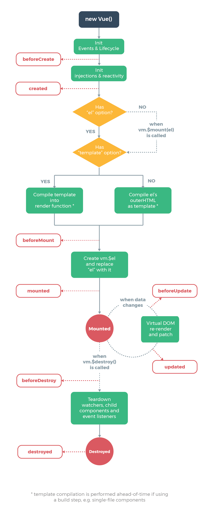

# Vue 组件化

Vue.js 另一个核心思想是组件化。所谓组件化，就是把页面拆分成多个组件 (component)，每个组件依赖的 CSS、JavaScript、模板、图片等资源放在一起开发和维护。组件是资源独立的，组件在系统内部可复用，组件和组件之间可以嵌套。

我们在用 Vue.js 开发实际项目的时候，就是像搭积木一样，编写一堆组件拼装生成页面。在 Vue.js 的官网中，也是花了大篇幅来介绍什么是组件，如何编写组件以及组件拥有的属性和特性。

们将从源码的角度来分析 Vue 的组件内部是如何工作的，只有了解了内部的工作原理，才能让我们使用它的时候更加得心应手。

会用 Vue-cli 初始化的代码为例，来分析一下 Vue 组件初始化的一个过程。

```js
import Vue from 'vue'
import App from './App.vue'

var app = new Vue({
  el: '#app',
  // 这里的 h 是 createElement 方法
  render: h => h(App)
})
```

这次通过`createElement` 传的参数是一个组件而不是一个原生的标签，那么接下来我们就开始分析这一过程。

## createComponent

我们在分析 `createElement` 的实现的时候，它最终会调用 `_createElement` 方法，其中有一段逻辑是对参数 `tag` 的判断，如果是一个普通的 html 标签，像上一章的例子那样是一个普通的 div，则会实例化一个普通 VNode 节点，否则通过 `createComponent` 方法创建一个组件 VNode。

```js
if (typeof tag === 'string') {
  let Ctor
  ns = (context.$vnode && context.$vnode.ns) || config.getTagNamespace(tag)
  if (config.isReservedTag(tag)) {
    // platform built-in elements
    vnode = new VNode(
      config.parsePlatformTagName(tag), data, children,
      undefined, undefined, context
    )
  } else if (isDef(Ctor = resolveAsset(context.$options, 'components', tag))) {
    // component
    vnode = createComponent(Ctor, data, context, children, tag)
  } else {
    // unknown or unlisted namespaced elements
    // check at runtime because it may get assigned a namespace when its
    // parent normalizes children
    vnode = new VNode(
      tag, data, children,
      undefined, undefined, context
    )
  }
} else {
  // direct component options / constructor
  vnode = createComponent(tag, data, context, children)
}
```

在我们这一章传入的是一个 App 对象，它本质上是一个 `Component` 类型，那么它会走到上述代码的 else 逻辑，直接通过 `createComponent` 方法来创建 `vnode`。所以接下来我们来看一下 `createComponent` 方法的实现，它定义在 `src/core/vdom/create-component.js` 文件中：

```js
export function createComponent (
  Ctor: Class<Component> | Function | Object | void,
  data: ?VNodeData,
  context: Component,
  children: ?Array<VNode>,
  tag?: string
): VNode | Array<VNode> | void {
  if (isUndef(Ctor)) {
    return
  }

  const baseCtor = context.$options._base

  // plain options object: turn it into a constructor
  // 普通选项对象:将其转换为构造函数
  if (isObject(Ctor)) {
    Ctor = baseCtor.extend(Ctor)
  }

  // if at this stage it's not a constructor or an async component factory,
  // reject.
  // 如果在这个阶段它不是一个构造函数或异步组件工厂
  if (typeof Ctor !== 'function') {
    if (process.env.NODE_ENV !== 'production') {
      warn(`Invalid Component definition: ${String(Ctor)}`, context)
    }
    return
  }

  // async component
  // 异步组件
  let asyncFactory
  if (isUndef(Ctor.cid)) {
    asyncFactory = Ctor
    Ctor = resolveAsyncComponent(asyncFactory, baseCtor)
    if (Ctor === undefined) {
      // return a placeholder node for async component, which is rendered
      // as a comment node but preserves all the raw information for the node.
      // 为异步组件返回一个占位符节点，该节点作为注释节点呈现，但保留该节点的所有原始信息。
      // the information will be used for async server-rendering and hydration.
      // 该信息将用于异步服务器呈现和hydration.
      return createAsyncPlaceholder(
        asyncFactory,
        data,
        context,
        children,
        tag
      )
    }
  }

  data = data || {}

  // resolve constructor options in case global mixins are applied after
  // component constructor creation
  // 解析构造函数选项，以防全局mixin在组件构造函数创建后被应用
  resolveConstructorOptions(Ctor)

  // transform component v-model data into props & events
  // 将组件v-model data转换为 props & events
  if (isDef(data.model)) {
    transformModel(Ctor.options, data)
  }

  // extract props
  // 提取 props
  const propsData = extractPropsFromVNodeData(data, Ctor, tag)

  // functional component
  // 功能组件
  if (isTrue(Ctor.options.functional)) {
    return createFunctionalComponent(Ctor, propsData, data, context, children)
  }

  // extract listeners, since these needs to be treated as
  // child component listeners instead of DOM listeners
  // 提取侦听器，因为这些侦听器需要被视为子组件侦听器，而不是DOM侦听器
  const listeners = data.on
  // replace with listeners with .native modifier
  // so it gets processed during parent component patch.
  // 用.native修饰符替换监听器，以便在父组件补丁期间处理
  data.on = data.nativeOn

  if (isTrue(Ctor.options.abstract)) {
    // abstract components do not keep anything
    // other than props & listeners & slot
    // 抽象组件只保留props、listeners和slot以外的任何东西

    // work around flow
    const slot = data.slot
    data = {}
    if (slot) {
      data.slot = slot
    }
  }

  // install component management hooks onto the placeholder node
  // 将组件管理挂钩安装到占位符节点上
  installComponentHooks(data)

  // return a placeholder vnode
  // 返回一个占位符vnode
  const name = Ctor.options.name || tag
  const vnode = new VNode(
    `vue-component-${Ctor.cid}${name ? `-${name}` : ''}`,
    data, undefined, undefined, undefined, context,
    { Ctor, propsData, listeners, tag, children },
    asyncFactory
  )

  // Weex specific: invoke recycle-list optimized @render function for
  // extracting cell-slot template.
  // https://github.com/Hanks10100/weex-native-directive/tree/master/component
  /* istanbul ignore if */
  if (__WEEX__ && isRecyclableComponent(vnode)) {
    return renderRecyclableComponentTemplate(vnode)
  }

  return vnode
}
```

可以看到，`createComponent` 的逻辑也会有一些复杂，但是分析源码比较推荐的是只分析核心流程，分支流程可以之后针对性的看，所以这里针对组件渲染这个 case 主要就 3 个关键步骤：

构造子类构造函数，安装组件钩子函数和实例化 `vnode`。

### 构造子类构造函数

```js
const baseCtor = context.$options._base

// plain options object: turn it into a constructor
if (isObject(Ctor)) {
  Ctor = baseCtor.extend(Ctor)
}
```

我们在编写一个组件的时候，通常都是创建一个普通对象，还是以我们的 App.vue 为例，代码如下：

```js
import HelloWorld from './components/HelloWorld'

export default {
  name: 'app',
  components: {
    HelloWorld
  }
}
```

这里 export 的是一个对象，所以 `createComponent` 里的代码逻辑会执行到 `baseCtor.extend(Ctor)`，在这里 `baseCtor` 实际上就是 Vue，这个的定义是在最开始初始化 Vue 的阶段，在 `src/core/global-api/index.js` 中的 `initGlobalAPI` 函数有这么一段逻辑：

```js
// this is used to identify the "base" constructor to extend all plain-object
// components with in Weex's multi-instance scenarios.
Vue.options._base = Vue
```

细心的同学会发现，这里定义的是 `Vue.options`，而我们的 `createComponent` 取的是 `context.$options`，实际上在 `src/core/instance/init.js` 里 Vue 原型上的 `_init` 函数中有这么一段逻辑：

```js
vm.$options = mergeOptions(
  resolveConstructorOptions(vm.constructor),
  options || {},
  vm
)
```

这样就把 Vue 上的一些 `option` 扩展到了 vm.$options 上，所以我们也就能通过 `vm.$options._base` 拿到 Vue 这个构造函数了。`mergeOptions` 的实现我们会在后续章节中具体分析，现在只需要理解它的功能是把 Vue 构造函数的 `options` 和用户传入的 `options` 做一层合并，到 `vm.$options ` 上。

在了解了 `baseCtor` 指向了 Vue 之后，我们来看一下 `Vue.extend` 函数的定义，在 `src/core/global-api/extend.js` 中。

```js
Vue.extend = function (extendOptions: Object): Function {
    extendOptions = extendOptions || {}
    const Super = this
    const SuperId = Super.cid
    const cachedCtors = extendOptions._Ctor || (extendOptions._Ctor = {})
    if (cachedCtors[SuperId]) {
      return cachedCtors[SuperId]
    }

    const name = extendOptions.name || Super.options.name
    if (process.env.NODE_ENV !== 'production' && name) {
      validateComponentName(name)
    }

    const Sub = function VueComponent (options) {
      this._init(options)
    }
    Sub.prototype = Object.create(Super.prototype)
    Sub.prototype.constructor = Sub
    Sub.cid = cid++
    Sub.options = mergeOptions(
      Super.options,
      extendOptions
    )
    Sub['super'] = Super

    // For props and computed properties, we define the proxy getters on
    // the Vue instances at extension time, on the extended prototype. This
    // avoids Object.defineProperty calls for each instance created.
    // 对于道具和计算属性，我们在扩展时在扩展原型的Vue实例上定义代理getter。 这将避免为创建的每个实例调用Object.defineProperty。
    if (Sub.options.props) {
      initProps(Sub)
    }
    if (Sub.options.computed) {
      initComputed(Sub)
    }

    // allow further extension/mixin/plugin usage
    // 允许进一步扩展/mixin/插件的使用
    Sub.extend = Super.extend
    Sub.mixin = Super.mixin
    Sub.use = Super.use

    // create asset registers, so extended classes
    // can have their private assets too.
    ASSET_TYPES.forEach(function (type) {
      Sub[type] = Super[type]
    })
    // enable recursive self-lookup
    if (name) {
      Sub.options.components[name] = Sub
    }

    // keep a reference to the super options at extension time.
    // later at instantiation we can check if Super's options have
    // been updated.
    // 在扩展时保留对超级选项的引用。 稍后在实例化时，我们可以检查Super的选项是否已经更新。
    Sub.superOptions = Super.options
    Sub.extendOptions = extendOptions
    Sub.sealedOptions = extend({}, Sub.options)

    // cache constructor
    cachedCtors[SuperId] = Sub
    return Sub
  }
```

`Vue.extend` 的作用就是构造一个 `Vue` 的子类，它使用一种非常经典的原型继承的方式把一个纯对象转换一个继承于 `Vue` 的构造器 `Sub` 并返回，然后对 `Sub` 这个对象本身扩展了一些属性，如扩展 `options`、添加全局 API 等；并且对配置中的 `props` 和 `computed` 做了初始化工作；最后对于这个 `Sub` 构造函数做了缓存，避免多次执行 `Vue.extend` 的时候对同一个子组件重复构造。

这样当我们去实例化 `Sub` 的时候，就会执行 `this._init` 逻辑再次走到了 `Vue` 实例的初始化逻辑，实例化子组件的逻辑在之后的章节会介绍。

```js
const Sub = function VueComponent (options) {
  this._init(options)
}
```

### 安装组件钩子函数

```js
  // install component management hooks onto the placeholder node
  // 将组件管理挂钩安装到占位符节点上
  installComponentHooks(data)
```

我们之前提到 Vue.js 使用的 Virtual DOM 参考的是开源库 [snabbdom](https://github.com/snabbdom/snabbdom)，它的一个特点是在 VNode 的 patch 流程中对外暴露了各种时机的钩子函数，方便我们做一些额外的事情，Vue.js 也是充分利用这一点，在初始化一个 Component 类型的 VNode 的过程中实现了几个钩子函数：

```js
// inline hooks to be invoked on component VNodes during patch
const componentVNodeHooks = {
  init (vnode: VNodeWithData, hydrating: boolean): ?boolean {
    if (
      vnode.componentInstance &&
      !vnode.componentInstance._isDestroyed &&
      vnode.data.keepAlive
    ) {
      // kept-alive components, treat as a patch
      const mountedNode: any = vnode // work around flow
      componentVNodeHooks.prepatch(mountedNode, mountedNode)
    } else {
      const child = vnode.componentInstance = createComponentInstanceForVnode(
        vnode,
        activeInstance
      )
      child.$mount(hydrating ? vnode.elm : undefined, hydrating)
    }
  },

  prepatch (oldVnode: MountedComponentVNode, vnode: MountedComponentVNode) {
    const options = vnode.componentOptions
    const child = vnode.componentInstance = oldVnode.componentInstance
    updateChildComponent(
      child,
      options.propsData, // updated props
      options.listeners, // updated listeners
      vnode, // new parent vnode
      options.children // new children
    )
  },

  insert (vnode: MountedComponentVNode) {
    const { context, componentInstance } = vnode
    if (!componentInstance._isMounted) {
      componentInstance._isMounted = true
      callHook(componentInstance, 'mounted')
    }
    if (vnode.data.keepAlive) {
      if (context._isMounted) {
        // vue-router#1212
        // During updates, a kept-alive component's child components may
        // change, so directly walking the tree here may call activated hooks
        // on incorrect children. Instead we push them into a queue which will
        // be processed after the whole patch process ended.
        queueActivatedComponent(componentInstance)
      } else {
        activateChildComponent(componentInstance, true /* direct */)
      }
    }
  },

  destroy (vnode: MountedComponentVNode) {
    const { componentInstance } = vnode
    if (!componentInstance._isDestroyed) {
      if (!vnode.data.keepAlive) {
        componentInstance.$destroy()
      } else {
        deactivateChildComponent(componentInstance, true /* direct */)
      }
    }
  }
}  
const hooksToMerge = Object.keys(componentVNodeHooks)

function installComponentHooks (data: VNodeData) {
  const hooks = data.hook || (data.hook = {})
  for (let i = 0; i < hooksToMerge.length; i++) {
    const key = hooksToMerge[i]
    const existing = hooks[key]
    const toMerge = componentVNodeHooks[key]
    if (existing !== toMerge && !(existing && existing._merged)) {
      hooks[key] = existing ? mergeHook(toMerge, existing) : toMerge
    }
  }
}

function mergeHook (f1: any, f2: any): Function {
  const merged = (a, b) => {
    // flow complains about extra args which is why we use any
    f1(a, b)
    f2(a, b)
  }
  merged._merged = true
  return merged
}
```

整个 `installComponentHooks` 的过程就是把 `componentVNodeHooks` 的钩子函数合并到 `data.hook` 中，在 VNode 执行 `patch` 的过程中执行相关的钩子函数，具体的执行我们稍后在介绍 `patch` 过程中会详细介绍。这里要注意的是合并策略，在合并过程中，如果某个时机的钩子已经存在 `data.hook` 中，那么通过执行 `mergeHook` 函数做合并，这个逻辑很简单，就是在最终执行的时候，依次执行这两个钩子函数即可。

### 实例化 VNode

```js
const name = Ctor.options.name || tag
const vnode = new VNode(
  `vue-component-${Ctor.cid}${name ? `-${name}` : ''}`,
  data, undefined, undefined, undefined, context,
  { Ctor, propsData, listeners, tag, children },
  asyncFactory
)
return vnode
```

最后一步非常简单，通过 `new VNode` 实例化一个 `vnode` 并返回。需要注意的是和普通元素节点的 `vnode` 不同，组件的 `vnode` 是没有 `children` 的，这点很关键，在之后的 `patch` 过程中我们会再提。

我们分析了 `createComponent` 的实现，了解到它在渲染一个组件的时候的 3 个关键逻辑：构造子类构造函数，安装组件钩子函数和实例化 `vnode`。`createComponent` 后返回的是组件 `vnode`，它也一样走到 `vm._update` 方法，进而执行了 `patch` 函数，

## patch

当我们通过 `createComponent` 创建了组件 VNode，接下来会走到 `vm._update`，执行 `vm.__patch__` 去把 VNode 转换成真正的 DOM 节点。这个过程我们在前一章已经分析过了，但是针对一个普通的 VNode 节点，接下来我们来看看组件的 VNode 会有哪些不一样的地方。

patch 的过程会调用 `createElm` 创建元素节点，回顾一下 `createElm` 的实现，它的定义在 `src/core/vdom/patch.js` 中

```js
function createElm (
  vnode,
  insertedVnodeQueue,
  parentElm,
  refElm,
  nested,
  ownerArray,
  index
) {
  // ...
  if (createComponent(vnode, insertedVnodeQueue, parentElm, refElm)) {
    return
  }
  // ...
}
```

### createComponent

我们删掉多余的代码，只保留关键的逻辑，这里会判断 `createComponent(vnode, insertedVnodeQueue, parentElm, refElm)` 的返回值，如果为 `true` 则直接结束，那么接下来看一下 `createComponent` 方法的实现：

```js
  function createComponent (vnode, insertedVnodeQueue, parentElm, refElm) {
    let i = vnode.data
    if (isDef(i)) {
      const isReactivated = isDef(vnode.componentInstance) && i.keepAlive
      if (isDef(i = i.hook) && isDef(i = i.init)) {
        i(vnode, false /* hydrating */)
      }
      // after calling the init hook, if the vnode is a child component
      // it should've created a child instance and mounted it. the child
      // component also has set the placeholder vnode's elm.
      // in that case we can just return the element and be done.
      // 在调用init钩子之后，如果vnode是一个子组件，它应该创建一个子实例并挂载它。
      // 子组件还设置了vnode的elm占位符。 在这种情况下，我们只需要返回元素就可以了。
      if (isDef(vnode.componentInstance)) {
        initComponent(vnode, insertedVnodeQueue)
        insert(parentElm, vnode.elm, refElm)
        if (isTrue(isReactivated)) {
          reactivateComponent(vnode, insertedVnodeQueue, parentElm, refElm)
        }
        return true
      }
    }
  }
```

`createComponent` 函数中，首先对 `vnode.data` 做了一些判断：

```js
let i = vnode.data
if (isDef(i)) {
  // ...
  if (isDef(i = i.hook) && isDef(i = i.init)) {
    i(vnode, false /* hydrating */)
    // ...
  }
  // ..
}
```

如果 `vnode` 是一个组件 VNode，那么条件会满足，并且得到 `i` 就是 `init` 钩子函数，回顾上节我们在创建组件 VNode 的时候合并钩子函数中就包含 `init` 钩子函数，定义在 `src/core/vdom/create-component.js` 中：

```js
init (vnode: VNodeWithData, hydrating: boolean): ?boolean {
  if (
    vnode.componentInstance &&
    !vnode.componentInstance._isDestroyed &&
    vnode.data.keepAlive
  ) {
    // kept-alive components, treat as a patch
    const mountedNode: any = vnode // work around flow
    componentVNodeHooks.prepatch(mountedNode, mountedNode)
  } else {
    const child = vnode.componentInstance = createComponentInstanceForVnode(
      vnode,
      activeInstance
    )
    child.$mount(hydrating ? vnode.elm : undefined, hydrating)
  }
},
```

`init` 钩子函数执行也很简单，我们先不考虑 `keepAlive` 的情况，它是通过 `createComponentInstanceForVnode` 创建一个 Vue 的实例，然后调用 `$mount` 方法挂载子组件，
先来看一下 `createComponentInstanceForVnode` 的实现：

```js
export function createComponentInstanceForVnode (
  vnode: any, // we know it's MountedComponentVNode but flow doesn't
  parent: any, // activeInstance in lifecycle state
): Component {
  const options: InternalComponentOptions = {
    _isComponent: true,
    _parentVnode: vnode,
    parent
  }
  // check inline-template render functions
  const inlineTemplate = vnode.data.inlineTemplate
  if (isDef(inlineTemplate)) {
    options.render = inlineTemplate.render
    options.staticRenderFns = inlineTemplate.staticRenderFns
  }
  return new vnode.componentOptions.Ctor(options)
}
```

`createComponentInstanceForVnode` 函数构造的一个内部组件的参数，然后执行 `new vnode.componentOptions.Ctor(options)`。这里的 `vnode.componentOptions.Ctor` 对应的就是子组件的构造函数，我们上一节分析了它实际上是继承于 Vue 的一个构造器 `Sub`，相当于 `new Sub(options)` 这里有几个关键参数要注意几个点，`_isComponent` 为 `true` 表示它是一个组件，`parent` 表示当前激活的组件实例（注意，这里比较有意思的是如何拿到组件实例，后面会介绍。

所以子组件的实例化实际上就是在这个时机执行的，并且它会执行实例的 `_init` 方法，这个过程有一些和之前不同的地方需要挑出来说，代码在 `src/core/instance/init.js` 中：

```js
Vue.prototype._init = function (options?: Object) {
  const vm: Component = this
  // merge options
  if (options && options._isComponent) {
    // optimize internal component instantiation
    // since dynamic options merging is pretty slow, and none of the
    // internal component options needs special treatment.
    initInternalComponent(vm, options)
  } else {
    vm.$options = mergeOptions(
      resolveConstructorOptions(vm.constructor),
      options || {},
      vm
    )
  }
  // ...
  if (vm.$options.el) {
    vm.$mount(vm.$options.el)
  } 
}
```

这里首先是合并 `options` 的过程有变化，`_isComponent` 为 true，所以走到了 `initInternalComponent` 过程，这个函数的实现也简单看一下：

```js
export function initInternalComponent (vm: Component, options: InternalComponentOptions) {
  const opts = vm.$options = Object.create(vm.constructor.options)
  // doing this because it's faster than dynamic enumeration.
  const parentVnode = options._parentVnode
  opts.parent = options.parent
  opts._parentVnode = parentVnode

  const vnodeComponentOptions = parentVnode.componentOptions
  opts.propsData = vnodeComponentOptions.propsData
  opts._parentListeners = vnodeComponentOptions.listeners
  opts._renderChildren = vnodeComponentOptions.children
  opts._componentTag = vnodeComponentOptions.tag

  if (options.render) {
    opts.render = options.render
    opts.staticRenderFns = options.staticRenderFns
  }
}
```

这个过程我们重点记住以下几个点即可：`opts.parent = options.parent`、`opts._parentVnode = parentVnode`，它们是把之前我们通过 `createComponentInstanceForVnode` 函数传入的几个参数合并到内部的选项 `$options` 里了。

再来看一下 `_init` 函数最后执行的代码：

```js
if (vm.$options.el) {
   vm.$mount(vm.$options.el)
}
```

由于组件初始化的时候是不传 el 的，因此组件是自己接管了 `$mount` 的过程，这个过程的主要流程在上一章介绍过了，回到组件 `init` 的过程，`componentVNodeHooks` 的 `init` 钩子函数，在完成实例化的 `_init` 后，接着会执行 `child.$mount(hydrating ? vnode.elm : undefined, hydrating)` 。这里 `hydrating` 为 true 一般是服务端渲染的情况，我们只考虑客户端渲染，所以这里 `$mount` 相当于执行 `child.$mount(undefined, false)`，它最终会调用 `mountComponent` 方法，进而执行 `vm._render()` 方法：

```js
Vue.prototype._render = function (): VNode {
  const vm: Component = this
  const { render, _parentVnode } = vm.$options

  
  // set parent vnode. this allows render functions to have access
  // to the data on the placeholder node.
  vm.$vnode = _parentVnode
  // render self
  let vnode
  try {
    vnode = render.call(vm._renderProxy, vm.$createElement)
  } catch (e) {
    // ...
  }
  // set parent
  vnode.parent = _parentVnode
  return vnode
}
```

我们只保留关键部分的代码，这里的 `_parentVnode` 就是当前组件的父 VNode，而 `render` 函数生成的 `vnode` 当前组件的渲染 `vnode`，`vnode` 的 `parent` 指向了 `_parentVnode`，也就是 `vm.$vnode`，它们是一种父子的关系。

我们知道在执行完 `vm._render` 生成 VNode 后，接下来就要执行 `vm._update` 去渲染 VNode 了。来看一下组件渲染的过程中有哪些需要注意的，`vm._update` 的定义在 `src/core/instance/lifecycle.js` 中：

```js
 Vue.prototype._update = function (vnode: VNode, hydrating?: boolean) {
    const vm: Component = this
    const prevEl = vm.$el
    const prevVnode = vm._vnode
    const restoreActiveInstance = setActiveInstance(vm)
    vm._vnode = vnode
    // Vue.prototype.__patch__ is injected in entry points
    // based on the rendering backend used.
    // Vue.prototype.__patch__ 基于所使用的渲染后端注入到入口点中。
    if (!prevVnode) {
      // initial render
      vm.$el = vm.__patch__(vm.$el, vnode, hydrating, false /* removeOnly */)
    } else {
      // updates
      vm.$el = vm.__patch__(prevVnode, vnode)
    }
    restoreActiveInstance()
    // update __vue__ reference
    if (prevEl) {
      prevEl.__vue__ = null
    }
    if (vm.$el) {
      vm.$el.__vue__ = vm
    }
    // if parent is an HOC, update its $el as well
    if (vm.$vnode && vm.$parent && vm.$vnode === vm.$parent._vnode) {
      vm.$parent.$el = vm.$el
    }
    // updated hook is called by the scheduler to ensure that children are
    // updated in a parent's updated hook.
    // 调度程序调用更新钩子以确保子钩子在父钩子的更新钩子中被更新。
  }
```

`_update` 过程中有几个关键的代码，首先 `vm._vnode = vnode` 的逻辑，这个 `vnode` 是通过 `vm._render()` 返回的组件渲染 VNode，`vm._vnode` 和 `vm.$vnode` 的关系就是一种父子关系，用代码表达就是 `vm._vnode.parent === vm.$vnode`。还有一段比较有意思的代码：

```js
export let activeInstance: any = null
Vue.prototype._update = function (vnode: VNode, hydrating?: boolean) {
    // ...
    const prevActiveInstance = activeInstance
    activeInstance = vm
    if (!prevVnode) {
      // initial render
      vm.$el = vm.__patch__(vm.$el, vnode, hydrating, false /* removeOnly */)
    } else {
      // updates
      vm.$el = vm.__patch__(prevVnode, vnode)
    }
    activeInstance = prevActiveInstance
    // ...
}
```

这个 `activeInstance` 作用就是保持当前上下文的 Vue 实例，它是在 `lifecycle` 模块的全局变量，定义是 `export let activeInstance: any = null`，并且在之前我们调用 `createComponentInstanceForVnode` 方法的时候从 `lifecycle` 模块获取，并且作为参数传入的。因为实际上 JavaScript 是一个单线程，Vue 整个初始化是一个深度遍历的过程，在实例化子组件的过程中，它需要知道当前上下文的 Vue 实例是什么，并把它作为子组件的父 Vue 实例。之前我们提到过对子组件的实例化过程先会调用 `initInternalComponent(vm, options)` 合并 `options`，把 `parent` 存储在 `vm.$options` 中，在 `$mount` 之前会调用 `initLifecycle(vm)` 方法：

```js
export function initLifecycle (vm: Component) {
  const options = vm.$options

  // locate first non-abstract parent
  let parent = options.parent
  if (parent && !options.abstract) {
    while (parent.$options.abstract && parent.$parent) {
      parent = parent.$parent
    }
    parent.$children.push(vm)
  }

  vm.$parent = parent
  // ...
}
```

可以看到 `vm.$parent` 就是用来保留当前 `vm` 的父实例，并且通过 `parent.$children.push(vm)` 来把当前的 `vm` 存储到父实例的 `$children` 中。

在 `vm._update` 的过程中，把当前的 `vm` 赋值给 `activeInstance`，同时通过 `const prevActiveInstance = activeInstance` 用 `prevActiveInstance` 保留上一次的 `activeInstance`。实际上，`prevActiveInstance` 和当前的 `vm` 是一个父子关系，当一个 `vm` 实例完成它的所有子树的 patch 或者 update 过程后，`activeInstance` 会回到它的父实例，这样就完美地保证了 `createComponentInstanceForVnode` 整个深度遍历过程中，我们在实例化子组件的时候能传入当前子组件的父 Vue 实例，并在 `_init` 的过程中，通过 `vm.$parent` 把这个父子关系保留。

那么回到 `_update`，最后就是调用 `__patch__` 渲染 VNode 了。

```js
vm.$el = vm.__patch__(vm.$el, vnode, hydrating, false /* removeOnly */)
 
function patch (oldVnode, vnode, hydrating, removeOnly) {
  // ...
  let isInitialPatch = false
  const insertedVnodeQueue = []

  if (isUndef(oldVnode)) {
    // empty mount (likely as component), create new root element
    isInitialPatch = true
    createElm(vnode, insertedVnodeQueue)
  } else {
    // ...
  }
  // ...
}
```

这里又回到了本节开始的过程，之前分析过负责渲染成 DOM 的函数是 `createElm`，注意这里我们只传了 2 个参数，所以对应的 `parentElm` 是 `undefined`。我们再来看看它的定义：

```js
function createElm (
  vnode,
  insertedVnodeQueue,
  parentElm,
  refElm,
  nested,
  ownerArray,
  index
) {
  // ...
  if (createComponent(vnode, insertedVnodeQueue, parentElm, refElm)) {
    return
  }

  const data = vnode.data
  const children = vnode.children
  const tag = vnode.tag
  if (isDef(tag)) {
    // ...

    vnode.elm = vnode.ns
      ? nodeOps.createElementNS(vnode.ns, tag)
      : nodeOps.createElement(tag, vnode)
    setScope(vnode)

    /* istanbul ignore if */
    if (__WEEX__) {
      // ...
    } else {
      createChildren(vnode, children, insertedVnodeQueue)
      if (isDef(data)) {
        invokeCreateHooks(vnode, insertedVnodeQueue)
      }
      insert(parentElm, vnode.elm, refElm)
    }
    
    // ...
  } else if (isTrue(vnode.isComment)) {
    vnode.elm = nodeOps.createComment(vnode.text)
    insert(parentElm, vnode.elm, refElm)
  } else {
    vnode.elm = nodeOps.createTextNode(vnode.text)
    insert(parentElm, vnode.elm, refElm)
  }
}
```

注意，这里我们传入的 `vnode` 是组件渲染的 `vnode`，也就是我们之前说的 `vm._vnode`，如果组件的根节点是个普通元素，那么 `vm._vnode` 也是普通的 `vnode`，这里 `createComponent(vnode, insertedVnodeQueue, parentElm, refElm)` 的返回值是 false。接下来的过程就和我们上一章一样了，先创建一个父节点占位符，然后再遍历所有子 VNode 递归调用 `createElm`，在遍历的过程中，如果遇到子 VNode 是一个组件的 VNode，则重复本节开始的过程，这样通过一个递归的方式就可以完整地构建了整个组件树。

由于我们这个时候传入的 `parentElm` 是空，所以对组件的插入，在 `createComponent` 有这么一段逻辑：

```js
function createComponent (vnode, insertedVnodeQueue, parentElm, refElm) {
  let i = vnode.data
  if (isDef(i)) {
    // ....
    if (isDef(i = i.hook) && isDef(i = i.init)) {
      i(vnode, false /* hydrating */)
    }
    // ...
    if (isDef(vnode.componentInstance)) {
      initComponent(vnode, insertedVnodeQueue)
      insert(parentElm, vnode.elm, refElm)
      if (isTrue(isReactivated)) {
        reactivateComponent(vnode, insertedVnodeQueue, parentElm, refElm)
      }
      return true
    }
  }
}
```

在完成组件的整个 `patch` 过程后，最后执行 `insert(parentElm, vnode.elm, refElm)` 完成组件的 DOM 插入，如果组件 `patch` 过程中又创建了子组件，那么DOM 的插入顺序是先子后父。

一个组件的 VNode 是如何创建、初始化、渲染的过程也就介绍完毕了。在对组件化的实现有一个大概了解后，接下来我们来介绍一下这其中的一些细节。我们知道编写一个组件实际上是编写一个 JavaScript 对象，对象的描述就是各种配置，之前我们提到在 `_init` 的最初阶段执行的就是 `merge options` 的逻辑,下一节我们从源码角度来分析合并配置的过程。

- **patch 的整体流程**

createComponent -> 子组件初始化 -> 子组件 render -> 子组件patch

- `activeInstance` 为当前激活的 vm 实例；**vm.$node** 为组件的占位 **vnode**; **vm._vnode** 为组件渲染 **vnode**
- 嵌套数组的插入顺序是 **先子后父**


## 合并配置

 通过之前章节的源码分析我们知道，`new Vue` 的过程通常有 2 种场景，一种是外部我们的代码主动调用 `new Vue(options)` 的方式实例化一个 Vue 对象；另一种是我们上一节分析的组件过程中内部通过 `new Vue(options)` 实例化子组件。 

 无论哪种场景，都会执行实例的 `_init(options)` 方法，它首先会执行一个 `merge options` 的逻辑，相关的代码在 `src/core/instance/init.js` 中： 

```js
Vue.prototype._init = function (options?: Object) {
  // merge options
  if (options && options._isComponent) {
    // optimize internal component instantiation
    // since dynamic options merging is pretty slow, and none of the
    // internal component options needs special treatment.
    initInternalComponent(vm, options)
  } else {
    vm.$options = mergeOptions(
      resolveConstructorOptions(vm.constructor),
      options || {},
      vm
    )
  }
  // ...
}
```

可以看到不同场景对于 `options` 的合并逻辑是不一样的，并且传入的 `options` 值也有非常大的不同，接下来我会分开介绍 2 种场景的 options 合并过程。

为了更直观，我们可以举个简单的示例：

```js
import Vue from 'vue'

let childComp = {
  template: '<div>{{msg}}</div>',
  created() {
    console.log('child created')
  },
  mounted() {
    console.log('child mounted')
  },
  data() {
    return {
      msg: 'Hello Vue'
    }
  }
}

Vue.mixin({
  created() {
    console.log('parent created')
  }
})

let app = new Vue({
  el: '#app',
  render: h => h(childComp)
})
```

### 外部调用场景

 当执行 `new Vue` 的时候，在执行 `this._init(options)` 的时候，就会执行如下逻辑去合并 `options`： 

```js
vm.$options = mergeOptions(
  resolveConstructorOptions(vm.constructor),
  options || {},
  vm
)
```

 这里通过调用 `mergeOptions` 方法来合并，它实际上就是把 `resolveConstructorOptions(vm.constructor)` 的返回值和 `options` 做合并，`resolveConstructorOptions` 的实现先不考虑，在我们这个场景下，它还是简单返回 `vm.constructor.options`，相当于 `Vue.options`，那么这个值又是什么呢，其实在 `initGlobalAPI(Vue)` 的时候定义了这个值，代码在 `src/core/global-api/index.js` 中： 

```js
export function initGlobalAPI (Vue: GlobalAPI) {
  // ...
  Vue.options = Object.create(null)
  ASSET_TYPES.forEach(type => {
    Vue.options[type + 's'] = Object.create(null)
  })

  // this is used to identify the "base" constructor to extend all plain-object
  // components with in Weex's multi-instance scenarios.
  Vue.options._base = Vue

  extend(Vue.options.components, builtInComponents)
  // ...
}
```

 首先通过 `Vue.options = Object.create(null)` 创建一个空对象，然后遍历 `ASSET_TYPES`，`ASSET_TYPES` 的定义在 `src/shared/constants.js` 中： 

```js
export const ASSET_TYPES = [
  'component',
  'directive',
  'filter'
]
```

所以上面遍历 `ASSET_TYPES` 后的代码相当于：

```js
Vue.options.components = {}
Vue.options.directives = {}
Vue.options.filters = {}
```

接着执行了 `Vue.options._base = Vue`，它的作用在我们上节实例化子组件的时候介绍了。

最后通过 `extend(Vue.options.components, builtInComponents)` 把一些内置组件扩展到 `Vue.options.components` 上，Vue 的内置组件目前有 ``、`` 和 `` 组件，这也就是为什么我们在其它组件中使用 `` 组件不需要注册的原因，这块儿后续我们介绍 `` 组件的时候会详细讲。

那么回到 `mergeOptions` 这个函数，它的定义在 `src/core/util/options.js` 中：

```js
/**
 * Merge two option objects into a new one.
 * Core utility used in both instantiation and inheritance.
 */
export function mergeOptions (
  parent: Object,
  child: Object,
  vm?: Component
): Object {
  if (process.env.NODE_ENV !== 'production') {
    checkComponents(child)
  }

  if (typeof child === 'function') {
    child = child.options
  }

  normalizeProps(child, vm)
  normalizeInject(child, vm)
  normalizeDirectives(child)
  const extendsFrom = child.extends
  if (extendsFrom) {
    parent = mergeOptions(parent, extendsFrom, vm)
  }
  if (child.mixins) {
    for (let i = 0, l = child.mixins.length; i < l; i++) {
      parent = mergeOptions(parent, child.mixins[i], vm)
    }
  }
  const options = {}
  let key
  for (key in parent) {
    mergeField(key)
  }
  for (key in child) {
    if (!hasOwn(parent, key)) {
      mergeField(key)
    }
  }
  function mergeField (key) {
    const strat = strats[key] || defaultStrat
    options[key] = strat(parent[key], child[key], vm, key)
  }
  return options
}
```

`mergeOptions` 主要功能就是把 `parent` 和 `child` 这两个对象根据一些合并策略，合并成一个新对象并返回。比较核心的几步，先递归把 `extends` 和 `mixins` 合并到 `parent` 上，然后遍历 `parent`，调用 `mergeField`，然后再遍历 `child`，如果 `key` 不在 `parent` 的自身属性上，则调用 `mergeField`。

这里有意思的是 `mergeField` 函数，它对不同的 `key` 有着不同的合并策略。举例来说，对于生命周期函数，它的合并策略是这样的：

```js
function mergeHook (
  parentVal: ?Array<Function>,
  childVal: ?Function | ?Array<Function>
): ?Array<Function> {
  return childVal
    ? parentVal
      ? parentVal.concat(childVal)
      : Array.isArray(childVal)
        ? childVal
        : [childVal]
    : parentVal
}

LIFECYCLE_HOOKS.forEach(hook => {
  strats[hook] = mergeHook
})
```

这其中的 `LIFECYCLE_HOOKS` 的定义在 `src/shared/constants.js` 中：

```js
export const LIFECYCLE_HOOKS = [
  'beforeCreate',
  'created',
  'beforeMount',
  'mounted',
  'beforeUpdate',
  'updated',
  'beforeDestroy',
  'destroyed',
  'activated',
  'deactivated',
  'errorCaptured'
]
```

这里定义了 Vue.js 所有的钩子函数名称，所以对于钩子函数，他们的合并策略都是 `mergeHook` 函数。这个函数的实现也非常有意思，用了一个多层 3 元运算符，逻辑就是如果不存在 `childVal` ，就返回 `parentVal`；否则再判断是否存在 `parentVal`，如果存在就把 `childVal` 添加到 `parentVal` 后返回新数组；否则返回 `childVal` 的数组。所以回到 `mergeOptions` 函数，一旦 `parent` 和 `child` 都定义了相同的钩子函数，那么它们会把 2 个钩子函数合并成一个数组。

关于其它属性的合并策略的定义都可以在 `src/core/util/options.js` 文件中看到，这里不一一介绍了，感兴趣的同学可以自己看。

通过执行 `mergeField` 函数，把合并后的结果保存到 `options` 对象中，最终返回它。

因此，在我们当前这个 case 下，执行完如下合并后：

```js
vm.$options = mergeOptions(
  resolveConstructorOptions(vm.constructor),
  options || {},
  vm
)
```

`vm.$options` 的值差不多是如下这样：

```js
vm.$options = {
  components: { },
  created: [
    function created() {
      console.log('parent created')
    }
  ],
  directives: { },
  filters: { },
  _base: function Vue(options) {
    // ...
  },
  el: "#app",
  render: function (h) {
    //...
  }
}
```

### 组件场景

由于组件的构造函数是通过 `Vue.extend` 继承自 `Vue` 的，先回顾一下这个过程，代码定义在 `src/core/global-api/extend.js` 中。

```js
/**
 * Class inheritance
 */
Vue.extend = function (extendOptions: Object): Function {
  // ...
  Sub.options = mergeOptions(
    Super.options,
    extendOptions
  )

  // ...
  // keep a reference to the super options at extension time.
  // later at instantiation we can check if Super's options have
  // been updated.
  Sub.superOptions = Super.options
  Sub.extendOptions = extendOptions
  Sub.sealedOptions = extend({}, Sub.options)

  // ...
  return Sub
}
```

我们只保留关键逻辑，这里的 `extendOptions` 对应的就是前面定义的组件对象，它会和 `Vue.options` 合并到 `Sub.opitons` 中。

接下来我们再回忆一下子组件的初始化过程，代码定义在 `src/core/vdom/create-component.js` 中：

```js
export function createComponentInstanceForVnode (
  vnode: any, // we know it's MountedComponentVNode but flow doesn't
  parent: any, // activeInstance in lifecycle state
): Component {
  const options: InternalComponentOptions = {
    _isComponent: true,
    _parentVnode: vnode,
    parent
  }
  // ...
  return new vnode.componentOptions.Ctor(options)
}
```

这里的 `vnode.componentOptions.Ctor` 就是指向 `Vue.extend` 的返回值 `Sub`， 所以 执行 `new vnode.componentOptions.Ctor(options)` 接着执行 `this._init(options)`，因为 `options._isComponent` 为 true，那么合并 `options` 的过程走到了 `initInternalComponent(vm, options)` 逻辑。先来看一下它的代码实现，在 `src/core/instance/init.js` 中：

```js
export function initInternalComponent (vm: Component, options: InternalComponentOptions) {
  const opts = vm.$options = Object.create(vm.constructor.options)
  // doing this because it's faster than dynamic enumeration.
  const parentVnode = options._parentVnode
  opts.parent = options.parent
  opts._parentVnode = parentVnode

  const vnodeComponentOptions = parentVnode.componentOptions
  opts.propsData = vnodeComponentOptions.propsData
  opts._parentListeners = vnodeComponentOptions.listeners
  opts._renderChildren = vnodeComponentOptions.children
  opts._componentTag = vnodeComponentOptions.tag

  if (options.render) {
    opts.render = options.render
    opts.staticRenderFns = options.staticRenderFns
  }
}
```

`initInternalComponent` 方法首先执行 `const opts = vm.$options = Object.create(vm.constructor.options)`，这里的 `vm.constructor` 就是子组件的构造函数 `Sub`，相当于 `vm.$options = Object.create(Sub.options)`。

接着又把实例化子组件传入的子组件父 VNode 实例 `parentVnode`、子组件的父 Vue 实例 `parent` 保存到 `vm.$options` 中，另外还保留了 `parentVnode` 配置中的如 `propsData` 等其它的属性。

这么看来，`initInternalComponent` 只是做了简单一层对象赋值，并不涉及到递归、合并策略等复杂逻辑。

因此，在我们当前这个 case 下，执行完如下合并后：

```js
initInternalComponent(vm, options)
```

`vm.$options` 的值差不多是如下这样：

```js
vm.$options = {
  parent: Vue /*父Vue实例*/,
  propsData: undefined,
  _componentTag: undefined,
  _parentVnode: VNode /*父VNode实例*/,
  _renderChildren:undefined,
  __proto__: {
    components: { },
    directives: { },
    filters: { },
    _base: function Vue(options) {
        //...
    },
    _Ctor: {},
    created: [
      function created() {
        console.log('parent created')
      }, function created() {
        console.log('child created')
      }
    ],
    mounted: [
      function mounted() {
        console.log('child mounted')
      }
    ],
    data() {
       return {
         msg: 'Hello Vue'
       }
    },
    template: '<div>{{msg}}</div>'
  }
}
```

###  总结

那么至此，Vue 初始化阶段对于 `options` 的合并过程就介绍完了，我们需要知道对于 `options` 的合并有 2 种方式，子组件初始化过程通过 `initInternalComponent` 方式要比外部初始化 Vue 通过 `mergeOptions` 的过程要快，合并完的结果保留在 `vm.$options` 中。

纵观一些库、框架的设计几乎都是类似的，自身定义了一些默认配置，同时又可以在初始化阶段传入一些定义配置，然后去 merge 默认配置，来达到定制化不同需求的目的。只不过在 Vue 的场景下，会对 merge 的过程做一些精细化控制，虽然我们在开发自己的 JSSDK 的时候并没有 Vue 这么复杂，但这个设计思想是值得我们借鉴的。

外部调用场景下的合并配置是通过 `mergeOption`，并遵循一定的合并策略。

组件合并是通过 `initInternalComponent`，它的合并更快

框架、库的设计都是类似，自身定义了默认配置，同时可以在初始化阶段传入配置，然后 `merge` 配置，来达到定制化不同需求的目的。


## 生命周期

每个 Vue 实例在被创建之前都要经过一系列的初始化过程，例如需要设置数据监听、编译模板、挂载实例到 DOM，在数据变化更新 DOM 等。同时在这个过程中也会运行一些叫生命周期钩子的函数 ，给予用户机会在一些特定的场景下添加他们自己的代码。



在我们实际项目开发过程中，会非常频繁地和 Vue 组件的生命周期打交道，接下来我们就从源码的角度来看一下这些生命周期的钩子函数是如何被执行的。

源码中最终执行生命周期的函数都是调用 `callHook` 方法，它的定义在 `src/core/instance/lifecycle` 中：

```js
export function callHook (vm: Component, hook: string) {
  // #7573 disable dep collection when invoking lifecycle hooks
  pushTarget()
  const handlers = vm.$options[hook]
  if (handlers) {
    for (let i = 0, j = handlers.length; i < j; i++) {
      try {
        handlers[i].call(vm)
      } catch (e) {
        handleError(e, vm, `${hook} hook`)
      }
    }
  }
  if (vm._hasHookEvent) {
    vm.$emit('hook:' + hook)
  }
  popTarget()
}
```

`callHook` 函数的逻辑很简单，根据传入的字符串 `hook`，去拿到 `vm.$options[hook]` 对应的回调函数数组，然后遍历执行，执行的时候把 `vm` 作为函数执行的上下文。

在上一节中，我们详细地介绍了 Vue.js 合并 `options` 的过程，各个阶段的生命周期的函数也被合并到 `vm.$options` 里，并且是一个数组。因此 `callhook` 函数的功能就是调用某个生命周期钩子注册的所有回调函数。

了解了生命周期的执行方式后，接下来我们会具体介绍每一个生命周期函数它的调用时机。

### beforeCreate & created

`beforeCreate` 和 `created` 函数都是在实例化 `Vue` 的阶段，在 `_init` 方法中执行的，它的定义在 `src/core/instance/init.js` 中：

```js
Vue.prototype._init = function (options?: Object) {
  // ...
  initLifecycle(vm)
  initEvents(vm)
  initRender(vm)
  callHook(vm, 'beforeCreate')
  initInjections(vm) // resolve injections before data/props
  initState(vm)
  initProvide(vm) // resolve provide after data/props
  callHook(vm, 'created')
  // ...
}
```

可以看到 `beforeCreate` 和 `created` 的钩子调用是在 `initState` 的前后，`initState` 的作用是初始化 `props`、`data`、`methods`、`watch`、`computed` 等属性，之后我们会详细分析。那么显然 `beforeCreate` 的钩子函数中就不能获取到 `props`、`data` 中定义的值，也不能调用 `methods` 中定义的函数。

在这俩个钩子函数执行的时候，并没有渲染 DOM，所以我们也不能够访问 DOM，一般来说，如果组件在加载的时候需要和后端有交互，放在这俩个钩子函数执行都可以，如果是需要访问 `props`、`data` 等数据的话，就需要使用 `created` 钩子函数。之后我们会介绍 vue-router 和 vuex 的时候会发现它们都混合了 `beforeCreate` 钩子函数。

### beforeMount & mounted

顾名思义，`beforeMount` 钩子函数发生在 `mount`，也就是 DOM 挂载之前，它的调用时机是在 `mountComponent` 函数中，定义在 `src/core/instance/lifecycle.js` 中：

```js
export function mountComponent (
  vm: Component,
  el: ?Element,
  hydrating?: boolean
): Component {
  vm.$el = el
  // ...
  callHook(vm, 'beforeMount')

  let updateComponent
  /* istanbul ignore if */
  if (process.env.NODE_ENV !== 'production' && config.performance && mark) {
    updateComponent = () => {
      const name = vm._name
      const id = vm._uid
      const startTag = `vue-perf-start:${id}`
      const endTag = `vue-perf-end:${id}`

      mark(startTag)
      const vnode = vm._render()
      mark(endTag)
      measure(`vue ${name} render`, startTag, endTag)

      mark(startTag)
      vm._update(vnode, hydrating)
      mark(endTag)
      measure(`vue ${name} patch`, startTag, endTag)
    }
  } else {
    updateComponent = () => {
      vm._update(vm._render(), hydrating)
    }
  }

  // we set this to vm._watcher inside the watcher's constructor
  // since the watcher's initial patch may call $forceUpdate (e.g. inside child
  // component's mounted hook), which relies on vm._watcher being already defined
  new Watcher(vm, updateComponent, noop, {
    before () {
      if (vm._isMounted) {
        callHook(vm, 'beforeUpdate')
      }
    }
  }, true /* isRenderWatcher */)
  hydrating = false

  // manually mounted instance, call mounted on self
  // mounted is called for render-created child components in its inserted hook
  if (vm.$vnode == null) {
    vm._isMounted = true
    callHook(vm, 'mounted')
  }
  return vm
}
```

在执行 `vm._render()` 函数渲染 VNode 之前，执行了 `beforeMount` 钩子函数，在执行完 `vm._update()` 把 VNode patch 到真实 DOM 后，执行 `mounted` 钩子。注意，这里对 `mounted` 钩子函数执行有一个判断逻辑，`vm.$vnode` 如果为 `null`，则表明这不是一次组件的初始化过程，而是我们通过外部 `new Vue` 初始化过程。那么对于组件，它的 `mounted` 时机在哪儿呢？

之前我们提到过，组件的 VNode patch 到 DOM 后，会执行 `invokeInsertHook` 函数，把 `insertedVnodeQueue` 里保存的钩子函数依次执行一遍，它的定义在 `src/core/vdom/patch.js` 中：

```js
function invokeInsertHook (vnode, queue, initial) {
  // delay insert hooks for component root nodes, invoke them after the
  // element is really inserted
  if (isTrue(initial) && isDef(vnode.parent)) {
    vnode.parent.data.pendingInsert = queue
  } else {
    for (let i = 0; i < queue.length; ++i) {
      queue[i].data.hook.insert(queue[i])
    }
  }
}
```

该函数会执行 `insert` 这个钩子函数，对于组件而言，`insert` 钩子函数的定义在 `src/core/vdom/create-component.js` 中的 `componentVNodeHooks` 中：

```js
const componentVNodeHooks = {
  // ...
  insert (vnode: MountedComponentVNode) {
    const { context, componentInstance } = vnode
    if (!componentInstance._isMounted) {
      componentInstance._isMounted = true
      callHook(componentInstance, 'mounted')
    }
    // ...
  },
}
```

我们可以看到，每个子组件都是在这个钩子函数中执行 `mounted` 钩子函数，并且我们之前分析过，`insertedVnodeQueue` 的添加顺序是先子后父，所以对于同步渲染的子组件而言，`mounted` 钩子函数的执行顺序也是先子后父。 

### beforeUpdate & updated

顾名思义，`beforeUpdate` 和 `updated` 的钩子函数执行时机都应该是在数据更新的时候，到目前为止，我们还没有分析 Vue 的数据双向绑定、更新相关，下一章我会详细介绍这个过程。

`beforeUpdate` 的执行时机是在渲染 Watcher 的 `before` 函数中，我们刚才提到过：

```js
export function mountComponent (
  vm: Component,
  el: ?Element,
  hydrating?: boolean
): Component {
  // ...

  // we set this to vm._watcher inside the watcher's constructor
  // since the watcher's initial patch may call $forceUpdate (e.g. inside child
  // component's mounted hook), which relies on vm._watcher being already defined
  new Watcher(vm, updateComponent, noop, {
    before () {
      if (vm._isMounted) {
        callHook(vm, 'beforeUpdate')
      }
    }
  }, true /* isRenderWatcher */)
  // ...
}

```

注意这里有个判断，也就是在组件已经 `mounted` 之后，才会去调用这个钩子函数。

`update` 的执行时机是在`flushSchedulerQueue` 函数调用的时候，它的定义在 `src/core/observer/scheduler.js` 中：

```js
function flushSchedulerQueue () {
  // ...
  // 获取到 updatedQueue
  callUpdatedHooks(updatedQueue)
}

function callUpdatedHooks (queue) {
  let i = queue.length
  while (i--) {
    const watcher = queue[i]
    const vm = watcher.vm
    if (vm._watcher === watcher && vm._isMounted) {
      callHook(vm, 'updated')
    }
  }
}
```

`flushSchedulerQueue` 函数我们之后会详细介绍，可以先大概了解一下，`updatedQueue` 是更新了的 `wathcer` 数组，那么在 `callUpdatedHooks` 函数中，它对这些数组做遍历，只有满足当前 `watcher` 为 `vm._watcher` 以及组件已经 `mounted` 这两个条件，才会执行 `updated` 钩子函数。

我们之前提过，在组件 mount 的过程中，会实例化一个渲染的 `Watcher` 去监听 `vm` 上的数据变化重新渲染，这段逻辑发生在 `mountComponent` 函数执行的时候：

```js
export function mountComponent (
  vm: Component,
  el: ?Element,
  hydrating?: boolean
): Component {
  // ...
  // 这里是简写
  let updateComponent = () => {
      vm._update(vm._render(), hydrating)
  }
  new Watcher(vm, updateComponent, noop, {
    before () {
      if (vm._isMounted) {
        callHook(vm, 'beforeUpdate')
      }
    }
  }, true /* isRenderWatcher */)
  // ...
}
```

那么在实例化 `Watcher` 的过程中，在它的构造函数里会判断 `isRenderWatcher`，接着把当前 `watcher` 的实例赋值给 `vm._watcher`，定义在 `src/core/observer/watcher.js` 中：

```js
export default class Watcher {
  // ...
  constructor (
    vm: Component,
    expOrFn: string | Function,
    cb: Function,
    options?: ?Object,
    isRenderWatcher?: boolean
  ) {
    this.vm = vm
    if (isRenderWatcher) {
      vm._watcher = this
    }
    vm._watchers.push(this)
    // ...
  }
}
```

同时，还把当前 `wathcer` 实例 push 到 `vm._watchers` 中，`vm._watcher` 是专门用来监听 `vm` 上数据变化然后重新渲染的，所以它是一个渲染相关的 `watcher`，因此在 `callUpdatedHooks` 函数中，只有 `vm._watcher` 的回调执行完毕后，才会执行 `updated` 钩子函数。

### beforeDestroy & destroyed

顾名思义，`beforeDestroy` 和 `destroyed` 钩子函数的执行时机在组件销毁的阶段，组件的销毁过程之后会详细介绍，最终会调用 `$destroy` 方法，它的定义在 `src/core/instance/lifecycle.js` 中：

```js
Vue.prototype.$destroy = function () {
    const vm: Component = this
    if (vm._isBeingDestroyed) {
      return
    }
    callHook(vm, 'beforeDestroy')
    vm._isBeingDestroyed = true
    // remove self from parent
    const parent = vm.$parent
    if (parent && !parent._isBeingDestroyed && !vm.$options.abstract) {
      remove(parent.$children, vm)
    }
    // teardown watchers
    if (vm._watcher) {
      vm._watcher.teardown()
    }
    let i = vm._watchers.length
    while (i--) {
      vm._watchers[i].teardown()
    }
    // remove reference from data ob
    // frozen object may not have observer.
    if (vm._data.__ob__) {
      vm._data.__ob__.vmCount--
    }
    // call the last hook...
    vm._isDestroyed = true
    // invoke destroy hooks on current rendered tree
    vm.__patch__(vm._vnode, null)
    // fire destroyed hook
    callHook(vm, 'destroyed')
    // turn off all instance listeners.
    vm.$off()
    // remove __vue__ reference
    if (vm.$el) {
      vm.$el.__vue__ = null
    }
    // release circular reference (#6759)
    if (vm.$vnode) {
      vm.$vnode.parent = null
    }
  }
```

`beforeDestroy` 钩子函数的执行时机是在 `$destroy` 函数执行最开始的地方，接着执行了一系列的销毁动作，包括从 `parent` 的 `$children` 中删掉自身，删除 `watcher`，当前渲染的 VNode 执行销毁钩子函数等，执行完毕后再调用 `destroy` 钩子函数。

在 `$destroy` 的执行过程中，它又会执行 ` vm.__patch__(vm._vnode, null)` 触发它子组件的销毁钩子函数，这样一层层的递归调用，所以 `destroy` 钩子函数执行顺序是先子后父，和 `mounted` 过程一样。

### activated & deactivated

`activated` 和 `deactivated` 钩子函数是专门为 `keep-alive` 组件定制的钩子，我们会在介绍 `keep-alive` 组件的时候详细介绍，这里先留个悬念。

### 总结

这一节主要介绍了 Vue 生命周期中各个钩子函数的执行时机以及顺序，通过分析，我们知道了如在 `created` 钩子函数中可以访问到数据，在 `mounted` 钩子函数中可以访问到 DOM，在 `destroy` 钩子函数中可以做一些定时器销毁工作，了解它们有利于我们在合适的生命周期去做不同的事情。